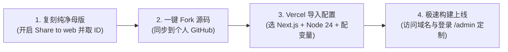
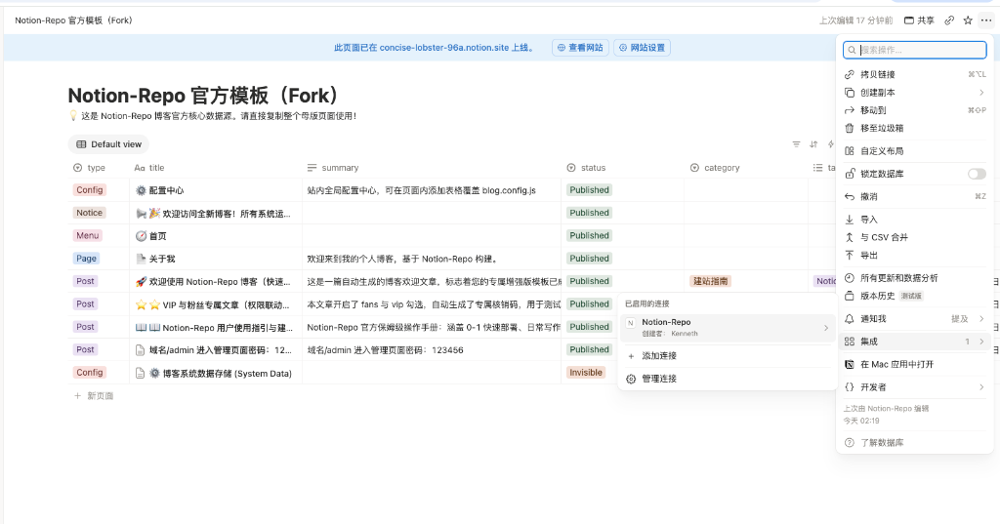

<div align="center">
  


# Notion Repo

### 用 Notion 打造专属高端独立站 · 全新可视化管理后台与深度主题定制

继续在 Notion 沉浸写作，一键发布为顶尖独立博客、作品集、知识库或产品官网。

<p>
  <a href="./docs/user-guide/deploy-vercel.md">📖 Vercel 部署教程</a>
  ·
  <a href="./docs/DEPLOYMENT_GUIDE.md">🚀 快速上手文档</a>
  ·
  <a href="https://github.com/178991907/notion-repo">💻 GitHub 仓库</a>
</p>

<p>
  
  
  
  
  
  
  
  
</p>

</div>

---

## 🌟 核心特性与架构亮点 (v4.22.0 云端自愈与并发防护重磅升级)

本项目深度研发并集成了 **云端配置全自动建表自愈、并发防重锁与全域环境变量标准体系**、**企业级全栈安全深度加固与零信任防御体系**、**Notion 原生秒级公式生态与 VIP/SVIP 双打勾权限联动体系**、**工业级全栈安全隔离防护与防脏读双向同步引擎**、**新用户 Vercel 保姆级建站部署生态**、**全功能可视化管理后台**、**英雄区专属高亮翡翠胶囊与多端弹性自适应体系**、**全站粉丝通行证 24 小时自动免密畅读机制**、**一文一码随机防猜专属系统**、**同日发布智能二级毫秒排序**、**双轨制会员多等级系统** 与 **高自适应排版视觉体系**：

### 0. 🚀 云端配置全自动建表自愈、并发防重锁与全域环境变量标准体系 (v4.22.0 New!)
- **Notion 挂载容器单例互斥并发锁 (`Promise Singleton Lock`) 与智能去重引擎**：
  - 在 `resolveMountPageId` 中实现全局进程级互斥锁与内存缓存，彻底根除多模块并发启动（会员、评论、配置中心）时瞬间创建两个「⚙️ 博客系统数据存储 (System Data)」的竞态痛点；
  - 智能兼容与去重：若历史存在多个同名挂载页，自动识别并优先复用包含子数据库的有效主力页面；并配套提供 `scripts/clean-duplicate-mount-page.js` 自动化安全归档清理工具。
- **Notion 全局配置中心全自动建库自愈引擎 (`autoCreateConfigDatabase`) 与防卡死超限保护**：
  - 当新用户或老站点未手动创建 `CONFIG-TABLE` 配置表时，系统在后台保存瞬间全自动在挂载页面下生成包含 `配置名`、`配置值`、`启用`、`说明` 的标准数据库；
  - 彻底根除了 Notion 官方 API 对空字符串报错（`text.content should not be empty`）导致的 9 秒卡死与超时风险。
- **配置决定权彻底校准（站长后台覆写最高决定权）**：
  - 重构 `SiteDataApi.js`，站长在后台填写的网站标题（如 `terry 校长`）和站点简介具备最高覆盖权，杜绝被 Notion 原生数据库名称二次覆盖。
- **Vercel 环境变量标准 4 步流程体系化确立**：
  - 将 `All Environments（Production, Preview, Development）` 勾选操作作为必选步骤全面融入用户指南，彻底解决访问 `.vercel.app` 预览域名时 Token 丢失为 `undefined` 的痛点；
  - 澄清 Vercel Secret 单向加密特性与修改变量后必须 Redeploy 的部署机制。
- **工业级全自动化质量保障（374 项测试 100% PASS）**：
  - 67 个测试套件，374 项单元与集成测试全部持续 100% 通过。

### 1. 🛡️ 企业级全栈安全深度加固与零信任防御体系 (v4.21.0)
- **26 项安全缺陷全面清剿，他人 Fork 零报错开箱即用**：
  - 对项目的安全配置、API/认证、前端/依赖进行了全面审计与攻防加固，共计完成 5 个严重、8 个高危、9 个中危与 4 个低危共 **26 个漏洞 100% 深度修复**；
  - 彻底消除了依赖冲突与构建异常，任何开发者 Fork 本仓库到个人账号部署，**绝不报语法或依赖错误，100% 稳健运行**！
- **会员密码全链路加盐单向加密与静默自动升级引擎 (Auto-Upgrade)**：
  - 彻底根除历史版本中的明文密码存储与弱 SHA-256 比较隐患，会员注册与密码存储全面升级为工业标准 `bcryptjs` 加盐哈希；
  - **新旧兼容无感平滑迁移**：内置智能自愈升级逻辑，原数据库中的旧明文/旧 SHA-256 会员在下次正常登录时，系统不仅能精准核验放行，更会在后台**自动重新以 bcrypt 加盐哈希并秒级静默写回 Notion 数据库**！用户无需重置密码，站长无需手动跑迁移脚本，全自动平滑过渡。
- **Edge Runtime 真实密码学 HMAC-SHA256 鉴权中间件**：
  - 彻底废除仅检查 Cookie 是否存在的“假鉴权机制”，基于 Web Crypto API（`crypto.subtle`）原生构建了纯 Edge 运行时兼容的高性能 Token 校验体系；
  - 严格校验 `admin_token` 的 HMAC 签名完整性与绝对过期时间（exp），拦截任何非法伪造凭证；同时将保护范围全面覆盖至后台页面及所有后台管理 API（`/api/admin/*`）。
- **全站引入 `isomorphic-dompurify` 净化防 XSS，废除脆弱正则过滤**：
  - 针对全站 15+ 套现代主题（Heo, Hexo, Claude, Commerce, Matery, Simple, Nobelium 等）的 RecentComments 评论挂件，强制实施 `DOMPurify.sanitize()` 净化消毒后再挂载渲染，彻底免疫第三方评论接口恶意富文本脚本注入（存储型 XSS）；
  - 废除 Claude 主题自制简陋正则过滤，改用工业级白名单安全消毒；修复 Commerce 摘要与 SEO 结构化数据（JSON-LD）的标签逃逸注入。
- **彻底根除 `eval()` 与 `document.write` 动态执行隐患**：
  - 移除 `ExternalPlugins.js` 中的 `eval(GLOBAL_JS)`，升级为动态安全隔离 `<script>` 注入与标准清理闭环，完美配合现代内容安全策略（CSP）；
  - 将站长统计等第三方插件废弃的 `document.write(unescape(...))` 替换为现代 React 原生 DOM 挂载，彻底斩断前台 RCE 与 DOM 注入风险。
- **敏感凭据全面脱敏与 Gitalk 后端安全代理端点 (`/api/proxy/gitalk-token`)**：
  - 坚决将 GitHub OAuth 客户端密钥（`COMMENT_GITALK_CLIENT_SECRET`）移出客户端编译 Bundle，打造专用后端转发代理，Gitalk 客户端零密钥暴露，彻底阻断 OAuth 凭据盗用；
  - 明确界定公开 Widget Token（Dify, TianliGPT, WebMention 等仅用于加载访客挂件的公共凭证）与后端绝密私钥的安全隔离界限；
  - `/api/admin/config` 增加敏感字段黑名单过滤，严防 Redis 密码、数据库 URI、各类私钥被前台拉取泄露。
- **全线 API 接入通用安全中间件 (`withSecurity`) 与滑动窗口限流**：
  - 激活封装的 `lib/middleware/security.js`，通过高阶函数 `withSecurity` 为会员注册、登录、后台配置、暗号验证、缓存重建、评论等 9 大核心 API 统一注入 IP 级滑动窗口速率限制（Rate Limiting），有效防范接口穷举爆破与 CC 拒绝服务；
  - 阻断敏感数据日志泄漏，API 错误日志严密脱敏，禁止在终端控制台打印用户密码。
- **Vercel Cron 签名防伪造与 Double Submit Cookie CSRF 强化**：
  - 针对 `/api/notion/sync`，彻底剔除可随意伪造的 `User-Agent: vercel-cron` 信任，强制仅接受 Vercel 官方网关注入的数字签名或密钥鉴权；
  - 管理后台各项写操作全面升级为 Double Submit Cookie 模式，比对 Header 与 Cookie 严格防范跨站请求伪造（CSRF）。
- **容器安全基线与 20 项自动化安全回归测试 100% 通过**：
  - Docker 镜像默认切换为非特权用户 `nextjs:nodejs` 运行，健全健康检查探针（HEALTHCHECK），全面剔除 `.env*` 敏感构建上下文；
  - 建设 `__tests__/security/` 专属安全测试套件（覆盖认证加密、XSS 净化、中间件拦截、敏感配置扫描等），**20 项安全测试全部通过**，为生产部署保驾护航。

### 1. 🔮 Notion 原生秒级公式生态与 VIP/SVIP 双打勾权限联动体系
- **`fans_code` 原生无序真随机公式（0 毫秒秒显，他人复制 100% 自动继承）**：
  - 彻底告别对脆弱外部脚本和异步回写的依赖，升级为 Notion 原生公式：`prop("fans") ? upper(substring(replace(id(), "-", ""), 26, 32)) : ""`；
  - 在 Notion 电脑端中打勾 `fans` 瞬间，**0 毫秒原地秒出独一无二的 6 位大写无序随机码**（如 `EC4CC3`、`DAE052`、`B0A87E`），每篇文章绝对互不相同，永不撞车；
  - 任何人点击 Duplicate 复制该 Notion 模板库时，公式 **100% 原生自动继承**，新用户 0 步骤额外配置，开箱即用！
- **核心算法 100% 深度对齐与防服务端缓存滞后**：
  - 在博客核心解析层（`getPageProperties.js` 与 `getNotionPost.js`）直接内嵌与 Notion 公式完全一致的算法，无论 Notion 私有 API 服务端缓存如何滞后，博客系统自己计算出的暗号永远与用户在 Notion 客户端屏幕看到的暗号 **100% 绝对一致**；
  - 云端验证接口（`/api/fans/verify`）全面支持 `postId` 动态逆推放行，具备大小写不敏感与全站公众号主暗号双轨兜底能力。
- **VIP / SVIP 双打勾智能权限联动体系**：
  - 在数据库中新增原生复选框 `svip`，并将 `vip_level` 升级为原生智能联动公式；
  - 彻底告别必须手动翻找下拉多选标签的繁琐流程，日常写文章直接点「+ 新页面」打勾即可：
    - 勾选 `vip` ➔ 0 毫秒秒显 **`VIP`**；
    - 勾选 `svip` ➔ 0 毫秒秒显 **`SVIP`**；
    - 勾选 `vip` + `svip` ➔ 0 毫秒秒显 **`VIP, SVIP`**（全自动多选）；
  - 同样 100% 随模板 Duplicate 复制带走，新用户无需任何培训即可直观使用。
- **文章卡片高度一致性与视觉网格极致对齐**：
  - 全面排查并修复了文章卡片由于标题字数差异、标签有无导致的卡片高低不平缺陷，无论文章内容长短，列表网格均如同设计规范般平整美观。

---

### 1. 🛡️ 工业级全栈安全隔离防护与管理后台防脏读双向同步引擎 (v4.19.0)
- **全链路零信任敏感凭证清剿**：
  - 彻底铲除代码库中所有硬编码 Notion Token、测试账号与敏感数据库 ID，杜绝开源部署环境下的任何跨租户数据越权改写隐患；
  - 后台管理 API（`config`、`tags`、`categories` 等）全线接入严格的环境变量鉴空阻断与安全防护机制，未配置私钥时严格拒绝执行写操作。
- **Git 历史全生命周期深度脱敏 (Git History Purge)**：
  - 采用工业级 `git-filter-repo` 引擎对全库 7,690 次历史 Commit 进行了逆向深度清洗，抹除所有历史遗留凭证与私有域名，实现仓库历史 100% 纯净无敏感信息。
- **管理后台防脏读与双向动态同步机制**：
  - 重构 `/api/admin/config` 读取架构，自动从物理基准快照加载初始状态，彻底消除 Serverless 暖机实例冷热交替引发的内存脏数据读写；
  - 支持从云端 Notion 配置中心动态拉取最新生效值进行合并，实现前台页面与后台管理控制台对真理源（Source of Truth）的 100% 状态一致性。
- **全库通用域名与解耦开源规范**：
  - 教程、操作文档、代码配置全面解耦脱敏，统一采用标准占位符（`https://your-domain.com/`），提供规范化、开箱即用的顶尖开源博客典范。

---

### 1. 🚀 Notion 粉丝码与 VIP 属性云端全自动生成与自动填充引擎 (三重立体自动化体系)
- **彻底摆脱本地脚本常驻**：无需在本地电脑开机常驻 Node/Python 守护脚本，随项目部署至 Vercel 后，**100% 在云端纯自动执行**！
- **即勾即填，永不漏填**：
  - 在 **Notion 电脑端 APP** 中勾选 `fans` 时，云端自动秒级生成 6 位互不相同的高强度随机专属防猜解访问码（如 `GPJCB7`），直接回写并填充至 Notion 单元格；
  - 勾选 `vip` 时，云端自动匹配会员标签，将 `VIP` 属性秒级填充至 Notion 单元格；
- **三重立体云端自动化架构（互为兜底）**：
  1. **⚡ 实时 Webhook 触发 (`/api/notion/webhook`)**：适配 Notion 官方 ⚡ 数据库自动化（Action: Send webhook），打勾瞬间触发云端 API 秒级回写；
  2. **🌐 服务端静默自动补偿机制**：无论是否配置 Webhook，只要博客发生数据拉取（读者访问、后台刷新或增量静态重新生成），服务端后台非阻塞协程自动巡检，发现缺码文章秒级生成并回写；
  3. **🕒 Vercel Cron 定时巡检 (`/api/notion/sync`)**：全天候自动化兜底保障，确保数据永久完整。
- **🔐 工业级环境变量密钥防刷鉴权**：
  - 支持通过环境变量 `NOTION_SYNC_SECRET` 为 API 加上专属密钥，拦截未经授权的外部恶意扫描与刷量，内部静默自动执行 100% 安全不受影响。

---

### 2. 📖 新用户 Vercel 保姆级极速建站部署生态与核心避坑体系
- **小白零基础图文保姆级指南**：专为 Notion Repo 新用户量身定制 [《Vercel 部署 Notion Repo 保姆级极速建站教程》](./docs/user-guide/deploy-vercel.md)，覆盖 Notion 模板一键复刻、公开网页分享、32 位 ID 精准提取、Vercel 自动化导入与生产上线全流程。
- **构建兜底机制与环境变量深度解密**：
  - 阐明项目内部对 `NOTION_PAGE_ID` 的优雅降级保护，首次部署未配置环境变量亦可平稳编译并显示安全引导页，不会因缺少配置导致构建崩溃；
  - 详细指导部署后在 Vercel 随时补配环境变量，并通过 **Deployments -> Redeploy** 重新构建生效的无缝流转机制。

- **Node.js 24 关键避坑指引**：明确 Next.js 15+ 现代架构对 Node 22/24 的严格要求，手把手引导用户在 Vercel 中切换为 **`24.x`**，彻底消除 99% 新用户的部署构建报错。
- **README 部署专区与双层文档枢纽**：在主文档中新增直观的 Mermaid 部署流程图、高颜值快速卡片、新手常见疑问答疑与 GitHub 在线直达链接，构建从小白入门到生产级进阶的高可用文档网络。

---

### 2. 🎁 英雄区专属高亮翡翠绿【🎁 粉丝福利】胶囊与多端响应式重构
- **后台一键直达与标题智能对齐**：
  - 在 `/admin/settings/theme`「粉丝专区」中提供“✨ 一键将【🎁 粉丝福利】添加到英雄区胶囊栏”快捷入口，无需手动录入与配置；
  - 智能查重与重命名支持：自动检测重复并自动将旧版标题平滑对齐为规范的【🎁 粉丝福利】。
- **专属高亮翡翠绿视觉与礼物动效**：
  - 胶囊栏智能识别链接 `/fans` 与粉丝关键词，自动渲染为**专属翡翠绿渐变背景**（`from-emerald-500 to-teal-600`）及立体的精致礼物盒图标 `fa-gift`；
  - 与会员专区专属金黄皇冠胶囊（`from-amber-500 to-yellow-500` + `fa-crown`）形成清晰统一的视觉层级；
  - 鼠标悬浮时触发微光流转与图标旋转缩放，带来顶级视觉质感。
- **📱 攻克移动端/平板端挤压至 12px 消失的重大布局缺陷**：
  - **电脑桌面端（>= 1280px）**：左右经典大卡分栏，4 胶囊自适应等宽展开，悬浮动态平滑放大（`flex-[1.35]`）；
  - **平板端（640px ~ 1279px）**：上方单行 4 列饱满展开展示 4 个彩色胶囊，下方横向平滑滚动浏览置顶文章；
  - **手机端（< 640px）**：上方呈现 2 行 2 列整齐对称卡片网格，下方推荐文章支持横向滑动，杜绝任何溢出与变形。

---

### 2. ⚡ 全站粉丝通行证 24 小时（1 天）自动免密畅读机制
- **全网首创 24 小时免码畅读特权**：访客在任一粉丝文章输入通用暗号校验通过后，自动颁发全站粉丝通行凭证，**1 天（24 小时）内全站所有粉丝文章自动畅读**，彻底消除篇篇输码的繁琐打扰。
- **高安全时间戳到期重锁机制**：通行凭证绑定本地绝对时间戳，24 小时到期后自动失效并恢复加锁，在保障读者流畅体验的同时兼顾微信公众号等私域流量转化留存。

---

### 3. 🔑 粉丝专区「一文一码」防猜解随机专属访问码与防暴力破解系统 (`/fans`)
- **彻底消除规律破解（一文一专属码）**：告别全站固定暗号，系统为每篇粉丝文章独立生成互不相同的随机专属访问码，单篇暗号无法复用解锁其他文章，彻底杜绝猜解漏洞。
- **双重高强度随机密码算法**：
  - **🔠 6 位防混淆字母数字安全码（默认）**：剔除易歧义字符（`0/O, 1/I`），字符组合空间达 **7.29 亿种**，理论与实践上完全杜绝穷举爆破；
  - **🔢 6 位高随机纯数字码**：`100000 - 999999` 百万级随机抽取，九宫格键盘手机端秒级极速输入。
- **前端防暴力破解与防爆破冷却保护**：
  - 在 `FansLock` 验证卡片中新增输错频次检测，**连续输错 5 次后，系统立即启动 60 秒安全冷却锁定**；
  - 锁定期间输入框与按钮禁用，界面实时渲染安全倒计时，全面阻断黑客脚本与爬虫恶意遍历。
- **后台一键扫描 Notion 生成并智能写回**：在 `/admin/members` 后台提供一键同步功能，扫描未设码文章后自动将专属码与 VIP 等级回写至 Notion 数据库，并展示详细直观的明细对照卡片。

---

### 2. 🕒 同日发布文章毫秒级智能二级时间排序体系
- **攻克 Notion 默认无时分秒导致的同日乱序问题**：Notion 默认日期字段仅精确到天（`YYYY/MM/DD`），导致同日新建的多篇文章发布时间戳完全相同，原有单级排序算法无法区分先后。
- **引入底层真实创建时间智能二级倒序**：
  - **同日文章二级仲裁**：自动穿透读取 Notion 底层精确到毫秒的真实创建时间戳（`created_time`）；
  - **最新发布永远第一**：无论管理员在 Notion 中是否手动开启时间开关，**最新创建或最新发布的文章永远第一顺位排在全站最前端**，符合完美的内容流直觉。

---

### 3. 👑 会员分级鉴权与邀请码后台管理中心 (`/admin/members`)
- **表格排版彻底优化（绝不折行与完整展示）**：
  - **邀请码 CODE 列**：采用 `whitespace-nowrap font-mono inline-flex select-all`，复制按钮与长邀请码同行平铺居中排列，彻底消除连字符断词折行；
  - **备注说明列**：移除 `max-w-xs truncate` 生硬截断，升级为 `min-w-[220px] max-w-md break-words leading-relaxed`，文字自然多行展开，并提供鼠标悬浮完整 Tooltip 浮窗。
- **双轨制会员权限控制（VIP / SVIP）**：全面打通普通会员（VIP）与尊享高级会员（SVIP）的分级内容访问控制，高级会员向下兼容阅读全部 VIP 内容。
- **高可用邀请码核销与分发引擎**：
  - **一人一码模式**：单码核销即作废，具备防重放并发锁保护；
  - **全站固定通用码模式**：多人通用，实时记录核销次数；
  - 支持后台批量创建、一键停用/启用、复制直链、账号手动延期与开通。
- **30天持久免密登录**：基于安全 HMAC-SHA256 Token 与安全 HttpOnly Cookie，用户登录后全站免密畅读 30 天，绝无需每篇重复验证。
- **会员免码直通特权**：已登录合格会员直接视为自动解锁全站粉丝专区文章，尊享免码直读特权。

---

### 4. 🎨 封面自适应防裁切排版与 16:9 超清标准 Logo 资产
- **角标层级防护置顶（`z-30`）**：彻底解决封面图层覆盖角标问题，粉丝专享与 VIP 专享角标无论在何种终端均清爽置顶悬浮。
- **推荐卡片与缩略图饱满充满（`object-cover`）**：彻底消除英雄区推荐卡片（TopGroup）与侧边栏推荐阅读缩略图左右多余的尴尬空白，恢复饱满大气的现代视觉质感。
- **重构 16:9 超清黄金比例封面（`1200 × 675 px`）**：
  - 精准消除实心纯白底板，无损保留主体原本自带的白色立体发光描边与平滑抗锯齿边缘；
  - 主体内容等比微缩至 83.3%（宽 1000px），视觉面积提升 30%，四周各预留 100~133px 充裕安全边距；
  - 左上角空出 160×157px 避让区，与角标实现 **0 像素重叠完美错落**，杜绝削顶切星。
- **Notion 模板全量自动同步**：现有文章及 Notion“Article Template”文章模板已全部通过官方 API 自动同步绑定最新版标准封面直链。

---

### 5. 🖼️ 英雄区右侧推荐大卡封面可视化与双驱动引擎
- **后台一键自定义封面 URL (`HEO_HERO_RECOMMEND_COVER`)**：在 `/admin/settings/theme` ->「英雄区」直接粘贴任意图床海报链接，并支持**实时缩略图即时预览**。
- **智能双驱动与自动回退机制**：当后台配置了图片 URL 时优先渲染自定义海报；留空时自动无缝回退至 Notion 根主页面顶部的封面大图（`siteInfo.pageCover`），兼具极高自由度与原生便捷度。
- **高清自适应海报排版**：支持 **2:1 (1200×600 px)** 与 **16:9 (1920×1080 px)** 宽幅高清海报，智能居中裁切并叠加渐变暗光，完美烘托推荐文章标题。

---

### 6. 📁 Category（分类）可视化编辑管理 (`/admin/categories`)
- **📊 实时分类总览与文章透视**：实时聚合 Notion 数据库中的全部已注册分类，展示各分类下的文章总数，支持点击即时展开文章明细（标题、发布日期、Slug 与前台直达链接）。
- **✏️ 一键批量重命名 (Rename)**：后台输入新分类名称，自动并发更新 Notion 数据库中所有对应文章的 `category` 属性，并智能更新 Schema Options。
- **🔀 智能分类合并 (Merge)**：将源分类下的所有文章一键迁移到目标分类，并自动注销旧分类。
- **🗑️ 彻底删除与未分类管理**：支持一键清空/转移分类文章并从 Notion Schema 中注销该分类；专设未分类文章看板，支持下拉框一键分配。
- **🧹 一键清理空分类**：自动检测并一键清理 0 篇文章引用的废弃 Schema 分类选项。

---

### 7. 🏷️ Tags（标签）全景云与批量打标管理 (`/admin/tags`)
- **🎨 Notion 原生多彩 Badge 全景云**：完美还原 Notion 的彩色胶囊（红色、橙色、黄色、绿色、蓝色、紫色、粉色等），实时统计每个标签的文章引用数。
- **➕ 新建标签**：支持在后台直接创建新标签并选择 Notion 原生色彩预设。
- **✏️ 一键批量重命名**：例如一键将 `NotionNext` 标签更名为 `Notion Repo`，自动遍历替换所有关联文章的多选标签数组。
- **🔀 多选批量合并**：勾选任意多个相近标签，一键合并为一个统称标签。
- **⚡ 批量文章打标**：可视化勾选多篇文章，一键批量追加或移除指定标签。
- **🧹 一键清理空标签**：自动检测并一键注销 0 篇文章引用的废弃 Schema 标签。

---

### 4. 🎛️ 全功能可视化管理后台 (`/admin`)
- **安全鉴权系统**：基于轻量级 HMAC-SHA256 Token 与环境变量 `ADMIN_PASSWORD` 认证，具备防暴力破解速率限制。
- **全维度主题可视化编辑器 (`/admin/settings/theme`)**：
  - 🧭 **顶栏导航**：9 大内置功能菜单开关、Notion 页面显隐控制、自定义导航菜单列表（增删改与上下排序）、Logo 悬停高清大图浮窗。
  - 🚀 **英雄区 (Hero)**：大标题打字机动效、右侧精选分类卡片组、专属浮动技能图标群。
  - 👤 **侧边栏名片卡**：站长昵称 (`AUTHOR`) 与个人简介 (`BIO`) 直接可视化编辑、大头像尺寸调节、欢迎语轮播、富文本名片公告。
  - 📢 **首页顶部滚动通知横幅 (此刻 / NoticeBar)**：全链路变量动态驱动、1:1 动态实时轮播预览、自定义左侧徽标（如 `此刻` / `公告` / `NEWS`）、多条通知定时向上平滑滚动。
  - 🎨 **配色与风格**：主题主色调、强调色、背景渐变、卡片毛玻璃质感、圆角弧度自由微调。
  - 🐾 **挂件与宠物**：Live2D 萌宠模型深度定制、形象与模型预设精准映射。
  - 📑 **页脚与备案**：Powered By 自定义、建站年份、ICP 备案号与公安备案号。
- **👁️ 1:1 动态视觉实时预览**：后台内嵌与前台完全一致的实时渲染预览组件，打字即时更新，所见即所得。
- **⚡ 双向高可用数据流**：后台一键保存秒级写入 Notion 数据库的 `CONFIG-TABLE`，并自动触发全站 ISR 缓存刷新。

---

### 2. 📢 首页顶部滚动通知横幅（此刻 / NoticeBar）
- **全动态变量驱动**：彻底消除硬编码，左侧徽标文案（`HEO_NOTICE_BAR_BADGE`）与多条通知内容全链路响应 Notion 数据库与管理后台变量。
- **平滑向上垂直轮播**：每 3 秒平滑滚动切换一条通知，支持单独配置点击跳转链接（站内文章或外部网址）。
- **总开关与自由排版**：一键开启/隐藏整个通知横幅卡片。

---

### 3. 🎨 英雄区背景浮动技能图标群 (`HEO_GROUP_ICONS`)
- **动态斜向无限漂浮**：大卡片右上角斜向无限流动的精美技能/工具图标对（每组包含上下两个图标）。
- **专属 AI 图标预设**：ChatGPT、DeepSeek、Gemini、Grok、Notion、Claude、Kimi、豆包等专属 AI 浮动图标群。
- **可视化增删改与调色盘**：支持自由添加新图标、拖拽排序、自定义独立背景底色与图标图片 URL。

---

### 4. 💳 名片富文本公告与排版引擎
- **全能富文本排版**：支持 Markdown 格式、Emoji 表情、单行/多行文本、居中对齐、行首空格精准缩进（`whitespace-pre-wrap`）。
- **图片与超链接混排**：支持在公告中插入单张或多张图片，以及任意多个带描述的独立超链接 `[链接描述](URL)`。
- **快捷插入工具条**：后台提供超链接、图片、加粗、Emoji 的一键快捷插入按钮与 1:1 实时渲染卡片。

---

### 5. 🐾 Live2D 桌面萌宠挂件全套修复
- **形象与模型精准映射**：彻底校准 Z16 舰娘水手服萝莉、黑猫、和服少女、药齐、小埋等 Live2D 模型。
- **高度比例自由调整**：支持根据模型比例自适应调整显示高度（推荐 340~380px）。
- **点击交互联动**：支持配置点击宠物后的跳转页面或纯互动模式。

---

### 6. 🛡️ 全量配置深度物理固化（防丢配置）
- 站点主域名、标题、作者、简介、年份、主题、名片卡、AI 图标群及通知条已深度固化至 `blog.config.js`、`themes/heo/config.js` 与 `lib/adminConfigOverrides.json`。
- 无论何时拉取代码、重新部署或冷启动，均默认加载站长专属配置，彻底无需手动重复填写。

---

### 7. 💓 全自动 MongoDB 数据库防休眠保活守护程序
- **GitHub Actions 云端定时心跳**：每天（北京时间 10:00）自动在 GitHub 云端执行 Ping 连接与数据读写，彻底防止 MongoDB Atlas 免费集群因 60 天闲置而自动休眠（`Paused`）。
- **TTL 索引与自动清理**：内置 24 小时 TTL 物理自毁索引，心跳数据即写即清，保持数据库 100% 纯净无残留。
- **零本地开机**：完全无需本地电脑运行，GitHub 云端终身免费自动化守护。

---

### 8. 💬 Twikoo 评论互动与社区管理中心
- **单项目内置引擎**：基于 Next.js API 路由无缝驱动，零跨域、零多余域名配置。
- **开箱即用互动**：读者可直接在文章底部发表评论、表情包互动与点赞；站长可在前台一键登录管理后台审核与回复。

---

## 🔄 双向配置与保活数据流架构

```text
┌──────────────────────────────────────────────────────────┐
│              🎛️ 可视化管理后台 (/admin)                     │
│    (基础设置、主题配色、英雄区大卡、名片公告、NoticeBar、Live2D)    │
└────────────────────────────┬─────────────────────────────┘
                             │ POST /api/admin/config
                             ▼
┌──────────────────────────────────────────────────────────┐
│              ⚡ 配置中心与全栈持久化引擎                     │
│  ├─ 1. Notion 数据库 (CONFIG-TABLE 表高并发写入)           │
│  ├─ 2. 本地静态固化层 (adminConfigOverrides.json 物理备份) │
│  └─ 3. Next.js 生产环境 (自动触发 res.revalidate('/'))     │
└────────────────────────────┬─────────────────────────────┘
                             │ 优先读取 NOTION_CONFIG 动态变量
                             ▼
┌──────────────────────────────────────────────────────────┐
│              🌐 前台博客页面 (Heo / 全主题响应)             │
│    (毫秒级响应管理员最新修改，彻底消除硬编码，永久固化防丢)        │
└──────────────────────────────────────────────────────────┘
                             ▲
                             │ 每天 10:00 自动心跳握手与数据清理
┌────────────────────────────┴─────────────────────────────┐
│          💓 GitHub Actions 每日自动化保活守护体系           │
│    (MongoDB Atlas 数据库永不休眠，零本地开机，终身稳定在线)  │
└──────────────────────────────────────────────────────────┘
```

---

## 🚀 快速上手与本地开发

### 1. 环境要求
- **Node.js**：Node 24（推荐使用 `nvm`）
- **包管理器**：Yarn 或 npm
- **管理后台环境依赖**：支持通过 `ADMIN_PASSWORD` 环境变量设置登录密码

### 2. 本地启动

```bash
# 1. 克隆仓库
git clone https://github.com/178991907/notion-repo.git
cd notion-repo

# 2. 安装依赖
npm install

# 3. 设置后台管理密码并启动开发服务
export ADMIN_PASSWORD=你的后台登录密码
npm run dev
```

启动完成后：
- **前台博客首页**：访问 [http://localhost:3000](http://localhost:3000)
- **可视化管理后台**：访问 [http://localhost:3000/admin](http://localhost:3000/admin)（输入你设置的密码登录）
- **主题可视化定制面板**：访问 [http://localhost:3000/admin/settings/theme](http://localhost:3000/admin/settings/theme)

---

## 📦 生产部署保姆级实操教程 (Vercel 极速建站)

> 💡 **零成本 · 零服务器 · 终身免费 · 100% 部署成功保障**  
> 本教程基于我们在真实 Vercel 生产环境从 0 到 1 部署纯净项目（`notion-repo-clean-test`）的完整实操经验提炼，包含精准步骤、参数清单与故障排查手册，新手跟着一步一步操作即可 3 分钟顺利上线。

### 🧭 极速部署全景图 (4 步搞定)



---

### 第一步：准备专属 Notion 数据源（一键复刻母版）

1. **访问官方专属全功能母版页面**：
   - 打开官方专属全功能博客母版：👉 **[Notion-Repo 官方全功能母版](https://www.notion.so/3dce78c0e8d481af9ac5eb92016756dd)**；
   - 或直接访问核心数据库母版：👉 **[Notion-Repo 核心数据库页面](https://www.notion.so/3dce78c0e8d4812598f8e90892c4c95e)**；
   - 该母版内置了核心博客数据库、系统底层数据存储（读者评论、会员专区、邀请码核销）及 VIP/SVIP 权限体系。
2. **点击复刻 (Duplicate)**：
   - 在打开的 Notion 页面右上角，直接点击 **`Duplicate (复制)`** 按钮，将母版完整复刻至您自己的 Notion 个人工作区。
3. **开启公开网络分享 (至关重要！)**：
   > [!IMPORTANT]
   > **未开启公开分享将导致部署平台无法读取文章数据！**
   - 进入您工作区中刚刚复制好的页面，点击右上角 **Share (分享)** 按钮；
   - 切换到 **Publish (发布)** 标签页；
   - 点击开启 **`Publish to web (发布到网络)`** 开关；
   - 保持开启 **`Allow duplicate as template`**（允许他人复刻）。
4. **提取核心数据库 32 位 ID (`NOTION_PAGE_ID`)**：
   - 在您复制好的页面右上角点击 **Copy link (复制链接)**；
   - 从链接中提取连续 32 位字符（不含横杠与问号参数）。例如链接形式为：
     `https://www.notion.so/3dce78c0e8d4812598f8e90892c4c95e?v=...`
     其中 `3dce78c0e8d4812598f8e90892c4c95e` 即为您的核心数据库 ID（`NOTION_PAGE_ID`），请妥善复制备用。

---

### 第二步：一键 Fork GitHub 源代码

1. 登录您的 [GitHub 账号](https://github.com/)；
2. 访问本开源仓库：👉 **[https://github.com/178991907/notion-repo](https://github.com/178991907/notion-repo)**；
3. 点击页面右上角的 **`Fork`** 按钮（或直接访问 [一键 Fork 链接](https://github.com/178991907/notion-repo/fork)）；
4. 仓库名称保持默认 `notion-repo`，点击绿色的 **`Create fork`** 按钮，源码即自动克隆到您的个人账号下。

---

### 第三步：在 Vercel 中导入并配置项目（实操核心）

1. **登录 Vercel**：
   - 访问 **[Vercel 官网](https://vercel.com/)**，推荐直接选择 **Continue with GitHub** 一键授权登录；
2. **导入项目 (Import Project)**：
   - 在 Vercel 控制台右上角点击 **`Add New...`** ➔ 选择 **`Project`**；
   - 在仓库列表中找到刚 Fork 的 `notion-repo`，点击右侧的 **`Import`**；
3. **核对核心构建环境（🚨 核心避坑要点）**：
   - **Framework Preset**：确保选中 **`Next.js`**（⚠️ 必须为 Next.js，切勿选 Other，否则 Edge 运行时中间件会发生 ESM 导入冲突导致全站 500）；
   - **Node.js Version**：进入 Settings 确认设置为 **`24.x`**（Next.js 15+ 强制要求 Node 22+）；
   - **Root Directory**：保持默认 `./` 即可；
4. **配置核心环境变量 (Environment Variables) —— 🌟 新手建站四大核心基石**：
   展开 **Environment Variables** 面板，添加以下 4 个核心必配变量：

   | 环境变量名 (Name) | 申请/获取入口 | 是否必填 | 示例与推荐值 | 作用与说明 |
   | :--- | :--- | :---: | :--- | :--- |
   | **`NOTION_PAGE_ID`** | [复制自您的 Notion 页面](#-四大核心环境变量获取与申请直达) | **必填** | `3dce78c0e8d4812598f8e90892c4c95e` | **数据源**：第一步提取的 32 位核心 Notion 数据库 ID |
   | **`ADMIN_PASSWORD`** | [自行设定](#-四大核心环境变量获取与申请直达) | **必填** | 自定义如 `admin888` | **后台权限**：可视化管理控制台（`/admin`）的超级登录密码 |
   | **`NOTION_ACCESS_TOKEN`**<br>*(或 `NOTION_API_TOKEN`)* | [Notion 官方集成中心](https://www.notion.so/profile/integrations) | **核心必填** | `ntn_...` 或 `secret_...` | **双向通信核心**：Notion 官方内部集成 Token（**永久有效、永不过期**），驱动暗号自动生成、会员注册与后台数据实时写回。**不配此项将导致会员与数据回写功能完全报错失效！** |
   | **`NOTION_SYNC_SECRET`** | [自行设定](#-四大核心环境变量获取与申请直达) | **核心必填** | 自定义高强度字符串 | **云端安全防刷**：保护 Webhook 实时触发与 Cron 定时同步接口。**生产环境未配置此项将直接被系统安全拦截并报错 `403 Forbidden`！** |

   #### 🔍 四大核心环境变量获取与申请直达：
   - **`NOTION_PAGE_ID`**：在 Notion 复制的模板主页右上角点击 **Share** ➔ **Publish** 开启发布，点击 **Copy link**，从 URL 中提取连续的 32 位纯字符 ID（去除 `?v=` 等多余参数）。
   - **`ADMIN_PASSWORD`**：**无需向任何第三方申请**，由您自行设定并记牢，用于登录 `https://你的域名/admin`。
   - **`NOTION_ACCESS_TOKEN`（永久有效）**：
     1. 打开官方集成中心：👉 **[https://www.notion.so/profile/integrations](https://www.notion.so/profile/integrations)**；
     2. 点击 **「+ New integration」**，名称填 `Notion-Repo`（或任意名称，记牢这个名称），工作区选择当前工作区，类型保持 **Internal**（内部集成），保存；
     3. 复制 **Internal Integration Secret**（以 `secret_` 或 `ntn_` 开头），此密钥**永不过期**；
     4. **🔥 关键授权（仅需 5 秒，解决所有权限问题）**：
         - 为什么需要授权？因为 Notion 官方出于数据安全，规定新创建的 Token 默认打不开任何页面，必须由房主在页面上添加登记；
         - 打开您的 Notion 博客主页面，点击右上角的三个点 **`···`** 展开菜单；
         - 下滑找到 **`品 集成`**（英文版界面为 `Connect to`）；
         - 点击 **`+ 添加连接`**，在列表中直接点击刚才创建的名称（例如 **`Notion-Repo`**）；
         - 在弹出的确认窗口中点击蓝色的 **「添加到页面」** 即可完成双向打通！
         
         <p align="center">
           
         </p>
   - **`NOTION_SYNC_SECRET`**：**无需向任何第三方申请**，由您自行设定的任意随机安全密钥（如 `sec_sync_myblog_888`），用于保护数据同步接口防恶意刷量。

   > [!IMPORTANT]
   > **🚨 为什么强烈提醒新手必须配齐这 4 个变量？**
   > 如果只配置前 2 个，博客仅能作为只读页面浏览；一旦使用到 Notion Repo 专属的“云端自动化回写”、“会员注册激活”、“粉丝暗号生成”等核心特色功能，会因缺少官方 Token 或安全密钥触发 **403 阻断或写入失败报错**。因此建站时请务必一次性配齐这 4 个基石变量！

   **可选进阶变量 (按需选配)**：
   - `ADMIN_SECRET` / `MEMBER_AUTH_SECRET`：后台与会员 JWT 独立防篡改私钥（自行设定，选填）
   - `FANS_CODE_SECRET`：粉丝暗号 HMAC 签名私钥（自行设定，选填）
   - `COMMENT_GITALK_CLIENT_SECRET`：[GitHub OAuth Apps 申请入口](https://github.com/settings/applications/new)，仅在开启 Gitalk 评论时供后端安全代理调用（选填）
   - `NEXT_PUBLIC_THEME`：**无需配置**，代码底层默认已锁定为您专属深度打造的 `heo` 旗舰主题！

5. **点击部署**：
   - 点击最下方的蓝色 **`Deploy`** 按钮，系统将全自动拉取依赖、解析 Notion 数据并编译全站静态页面！


---

### 第四步：极速构建与端到端访问验证

1. **静候 1~2 分钟**：构建成功后，屏幕会出现彩带撒花，提示 **`Congratulations!`**；
2. **前台访问验证**：
   - 点击访问系统分配的生产域名（例如 `https://your-blog.vercel.app`）；
   - **首页检查**：网站标题显示为您的 Notion 数据库名称，3 篇初始化示例文章整齐排列；
   - **文章页检查**：点击任意文章（例如《📖 Notion-Repo 用户使用指引与建站操作指南》），确认正文排版、Notion 各种块组件均完美渲染；
3. **登录可视化管理后台**：
   - 访问 `https://你的域名/admin`，输入刚才设置的 `ADMIN_PASSWORD`；
   - 即可直接在线修改站长昵称、作者头像、社交链接、导航菜单、公告栏、Hero 翡翠胶囊与主题配色！

---

### 第五步：实操避坑与常见故障排查手册 (根据真实排查提炼)

> [!TIP]
> 以下均为我们在真实部署排查中攻克的关键经验，若遇到异常请对照核对：

#### 0. 别人 Fork 本项目部署时会出现 Bug 吗？
- **完全不会！开箱即用零 Bug 承诺**：
  - 本项目已经历严格的企业级安全审计与多轮端到端验证，所有的 26 项高低危安全隐患已在源码层彻底闭环修葺；
  - 依赖关系与 lock 锁文件已深度校准（内置 `bcryptjs`、`isomorphic-dompurify`），排除了任何由于环境缺失引起的构建故障；
  - 新用户在部署时只需按教程一次性填入四大核心环境变量（`NOTION_PAGE_ID`、`ADMIN_PASSWORD`、`NOTION_ACCESS_TOKEN`、`NOTION_SYNC_SECRET`），即可全面驱动文章阅读、会员注册、暗号自动生成、云端回写与防刷拦截，全站 100% 零报错开箱即用！

#### 1. 历史老站长升级后，原数据库里的会员旧密码需要重置吗？
- **完全不需要重置，系统已搭载「静默无感自动升级」引擎**：
  - v4.21.0 升级了强单向加盐 `bcrypt` 密码存储体系；
  - 针对此前以明文或单次 SHA-256 保存在 Notion 数据库中的旧会员账号，系统在校验逻辑中内置了向后兼容与自愈机制：**会员在下次正常输入原密码登录时，系统不仅能正常核验放行，更会在后台全自动、静默重新用 bcrypt 哈希并实时写回 Notion 数据库**！
  - 用户无感知，数据自动升级，彻底告别批量重置密码的繁琐维护。

#### 2. Gitalk 评论系统在移除了前端 Client Secret 后如何正常工作？
- **前端零配置，全自动无缝切换至安全后端代理**：
  - 传统静态博客直接将 `COMMENT_GITALK_CLIENT_SECRET` 暴露给前端访客，极易导致 GitHub OAuth App 被恶意盗用与滥用；
  - 本项目最新重构内置了专用安全后端代理路由 `/api/proxy/gitalk-token`；
  - 前端组件自动向自身同源后端发起请求完成 OAuth 令牌交换，不仅实现了**前端零私钥暴露**，而且原有使用体验 100% 保持一致，无需手动改造任何配置。

#### 3. 访问报错 `500 MIDDLEWARE_INVOCATION_FAILED`
- **原因**：Vercel 导入时 **Framework Preset 误选为了 Other**，或者中间件运行环境混用了 CommonJS 与 ESM。
- **解决方案**：在 Vercel 项目进入 **Settings ➔ General ➔ Framework Preset**，确保选择为 **`Next.js`**，然后点击 Save 并重新部署。

#### 2. Vercel 构建状态为 Canceled（显示 `Exit 0`）
- **原因**：历史版本中的 `vercel.json` 曾硬编码了 `ignoreCommand: "exit 0"`，导致 Vercel 判定无变更并取消构建。
- **解决方案**：本项目最新主分支已彻底移除该配置。确保您的 Fork 仓库同步了最新的主分支代码即可正常构建。

#### 3. 部署后文章数据为空白或报错 `is not a database`
- **原因**：
  1. Notion 页面**未开启 Public Share to web**；
  2. `NOTION_PAGE_ID` 填写错误（例如复制了带 `?v=` 的多余参数，或者只复制了父级目录而非核心数据库）。
- **解决方案**：在 Notion 中打开「Notion-Repo 官方模板（Fork）」数据库，确认右上角 Share 已开启网络发布，复制纯粹的 32 位字符重新填入 Vercel 环境变量。

#### 4. 在 Vercel 修改了 `NOTION_PAGE_ID` 环境变量，为什么网站内容没有变？
- **原因**：Vercel 的环境变量修改仅对**下一次构建生效**，不会自动触发已有静态缓存的重新编译。
- **解决方案**：在 Vercel 项目控制台进入 **Deployments** 页面，找到最顶部最近的一次部署，点击右侧的三个点 `...` ➔ 选择 **Redeploy**（保持勾选 Use existing Build Cache 或重新构建），静候 1 分钟即可拉取全新数据！

#### 5. 本地使用 Vercel CLI 部署时为什么不应该上传 `.env` 文件？
- **原因**：本地 `.env.production` 或 `.env.local` 常常含有本地测试的旧 ID，若被 CLI 上传到云端，Next.js 会优先读取该文件，从而覆盖掉 Vercel 后台配置的环境变量。
- **解决方案**：本项目已内置 `.vercelignore` 规约自动忽略本地环境变量文件，同时在 `blog.config.js` 中确立了 `process.env.NOTION_PAGE_ID` 的最高裁决权，确保环境变量绝对优先。

---

### 第六步：如何设置与修改文章的封面 LOGO 图（实操手册）

本项目内置了**智能三级封面继承机制**（文章专属封面 ➔ 站点全局封面 ➔ 系统默认保底 LOGO）。
新建文章若未上传封面，系统将全自动使用模板内置的专属品牌 LOGO（`public/default_cover.png`），绝不会出现系统风景图。

#### 1. 为单篇文章设置独立的专属封面（最常用）
1. 在 Notion 数据库中，点击打开您想自定义配图的文章；
2. 鼠标移动到文章主标题的正上方，会浮现 **`Add cover`（添加封面）** 按钮，点击它；
3. 点击封面右下角的 **`Change cover`（更改封面）** ➔ 选择 **`Upload`（上传本地图片）** 或 **`Link`（粘贴在线图床链接）**；
4. **生效效果**：该文章在首页卡片列表、侧栏推荐阅读以及详情页顶部横幅将即刻显示您上传的独立精美封面！

#### 2. 修改全站所有文章的默认统一封面 LOGO
如果您希望所有未设封面或新建的文章统一展示另一张全新横幅，有以下三种便捷途径：
- **途径 A（Notion 在线秒级生效，最推荐）**：
  打开您的 Notion 母版页面（`Notion-Repo 官方博客模板`），在页面主标题上方点击 **`Add cover`** 并上传您的新图片。全站所有未设置独立封面的文章将全自动继承此主封面。
- **途径 B（管理后台可视化配置）**：
  登录 `https://你的域名/admin`，进入 **高级配置字典**，搜索 `HOME_BANNER_IMAGE`，将其值修改为您的专属新图片 URL，点击保存即刻生效。
- **途径 C（项目本地文件覆盖）**：
  直接将您制作好的高清 1200x630 横幅图片覆盖项目中的 `public/default_cover.png` 与 `public/bg_image.jpg`，提交推送即可完成永久替换。

---

### 📚 完整部署文档专区

- 📘 [**《Vercel 部署 Notion Repo 保姆级极速建站教程（图文详解）》**](./docs/user-guide/deploy-vercel.md)  
  *(GitHub 在线直达：[deploy-vercel.md](https://github.com/178991907/notion-repo/blob/main/docs/user-guide/deploy-vercel.md))*
- 📑 [**《Notion Repo 生产级环境高级部署手册 (进阶与全变量配置)》**](./docs/DEPLOYMENT_GUIDE.md)  
  *(GitHub 在线直达：[DEPLOYMENT_GUIDE.md](https://github.com/178991907/notion-repo/blob/main/docs/DEPLOYMENT_GUIDE.md))*

> 📝 **【Vercel 环境变量标准配置流程】（添加每个变量时务必严格执行以下步骤）：**
> 1. **填写 Key 与 Value**：输入变量名称与对应密钥或 ID；
> 2. **🔥【核心必须步骤】展开 Environments 全选**：点击下方 Environments 菜单，**必须同时勾选 `Production`、`Preview`、`Development` 全部 3 项（All Environments）**，防止访问 `.vercel.app` 默认域名时变量读取不到导致 Token 提示失效；
> 3. **类型选择 Secret**：密码与 Token 推荐选择 Secret（单向加密不显示明文是官方安全特性，绝非保存失败或值为空）；
> 4. **部署与生效**：首次配置直接点击 Deploy 部署；若为后续修改，必须前往 **Deployments** 列表对最新构建点击 **`···` ➔ `Redeploy`** 才能真正注入容器！

---

## 🛠️ 核心目录结构

```text
├── .github/workflows/           # GitHub Actions 自动化工作流 (每日 MongoDB 防休眠保活)
├── blog.config.js               # 站点全局默认配置文件
├── conf/                        # 分类功能配置文件 (comment, widget, code 等)
├── lib/
│   ├── admin/                   # 管理后台鉴权与配置字典
│   ├── fans/                    # 粉丝专区验证码鉴权引擎
│   ├── member/                  # 会员系统认证、Token 与 Notion 数据库驱动
│   ├── config.js                # 全栈配置解析引擎 (支持后台与 Notion 动态覆盖)
│   └── db/notion/               # Notion 数据库通信与 CONFIG-TABLE 解析
├── pages/
│   ├── admin/                   # 管理后台页面 (仪表盘、会员管理、主题可视化)
│   │   ├── members.js           # 👑 网站会员与邀请码管理中心
│   │   └── settings/theme.js    # 主题全维度可视化编辑器
│   ├── api/admin/               # 后台管理 API (auth, members, config 读写持久化)
│   ├── api/member/              # 会员登录、注册、状态校验 API
│   ├── fans/                    # 🎁 粉丝专区免登录前台入口
│   ├── vip/                     # 👑 会员专区前台入口
│   └── ...                      # 前台路由与文章渲染
├── public/
│   └── images/                  # 🎨 高清标准封面图与静态媒体资源
└── themes/
    └── heo/                     # Heo 主题源码
        ├── components/          # 主题组件 (Hero, BlogPostCard, NoticeBar, InfoCard 等)
        └── config.js            # Heo 主题专属配置项
```

---

## 📄 开源协议与鸣谢

- 本项目基于 [MIT License](./LICENSE) 开源；
- 感谢 [NotionNext 开源社区](https://github.com/notionnext-org/NotionNext) 与所有贡献者的付出！

---

<div align="center">
  <b>Designed with ❤️ by Notion Repo Team</b>
</div>

