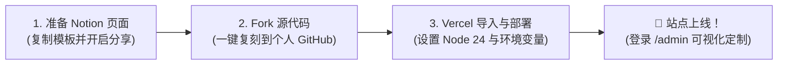

# Vercel 部署 Notion Repo 保姆级极速建站教程

> 本教程专为 **Notion Repo** 新手量身打造，带您从零开始、免费、极速搭建属于您自己的顶尖独立博客与知识库系统！  
> 源码仓库：[178991907/notion-repo](https://github.com/178991907/notion-repo)  
> 部署后访问：`https://你的自定义域名/` 或 `https://你的项目.vercel.app/`  
> 在线管理后台：`https://你的自定义域名/admin`

---

## 💡 为什么选择 Notion Repo + Vercel？

- **无需购买服务器，终身完全免费**：利用国外领先的 Serverless 托管平台 [Vercel](https://vercel.com/)，个人免费版额度充沛，无需承担任何服务器与带宽费用；
- **沉浸写作在 Notion**：所有的文章、随笔、专栏编写全部在 Notion 原生编辑器中完成，即写即发布，图文并茂、多端自动云同步；
- **全网独家可视化管理后台**：彻底告别传统静态博客改配置必须修改代码的痛点！内置专属后台控制台（`/admin`），网页端在线修改标题、头像、导航、英雄区胶囊与配色，秒级全站生效；
- **全端极速自适应与丰富生态**：搭载 Next.js 15+ 与 Tailwind CSS，集成 27 套现代旗舰主题（默认推荐 `heo`），全端完美自适应（桌面/平板/手机），更独家搭载了双轨制会员系统与 24 小时粉丝免密通行证体系。

---

## 🧭 部署前极速路线图 (只需 3 步)



---

## 第一步：准备您的 Notion 数据源

### 1. 复制官方模板 (Duplicate)
1. 打开并登录您的 [Notion 账号](https://www.notion.so/)（若无账号可免费注册）；
2. 访问官方推荐的 Notion 数据源模板：
   👉 **[Notion Repo 官方博客数据源模板](https://tanghh.notion.site/02ab3b8678004aa69e9e415905ef32a5)**
3. 在打开的 Notion 模板页面右上角，点击 **Duplicate (复制)** 按钮，将模板完整复刻到您自己的个人 Notion 工作区中。

### 2. 开启公开网页分享 (Publish to web)
> [!IMPORTANT]
> **必须开启网络发布**，否则 Vercel 无法读取您的笔记数据！

1. 在复制到您工作区后的根页面中，点击右上角的 **Share (分享)** 按钮；
2. 切换到 **Publish (发布)** 选项卡；
3. 点击开启 **Publish to web (发布到网络)** 开关；
4. 确认开启后，点击 **Copy link (复制链接)**。

### 3. 获取并准确提取 32 位页面 ID (`NOTION_PAGE_ID`)
请仔细观察您刚才复制出的公开分享链接：

- **格式一（经典格式）**：
  ```text
  https://yourname.notion.site/02ab3b8678004aa69e9e415905ef32a5?v=b7eb2157...
  ```
  此时位于链接中间由纯数字与小写字母组成的 **连续 32 位字符** 即为页面 ID：
  👉 `02ab3b8678004aa69e9e415905ef32a5`

- **格式二（新版带标题格式）**：
  ```text
  https://yourname.notion.site/My-Blog-02ab3b8678004aa69e9e415905ef32a5?pvs=4
  ```
  此时位于标题短横线后面、问号前面的 **连续 32 位字符** 即为页面 ID：
  👉 `02ab3b8678004aa69e9e415905ef32a5`

> [!WARNING]
> **避坑提醒**：只复制这 32 位的纯字符串！**切勿包含 `?v=`、`?pvs=4` 及其后面的任何多余字符**。请将这串 32 位 ID 妥善暂存，下一步将用到。

---

## 第二步：一键 Fork GitHub 源代码

> [!TIP]
> **账号注册避坑建议**：注册 GitHub 账号时，建议使用 **Gmail、Outlook 等国际主流邮箱**，避免使用部分国内邮箱导致后续注册 Vercel 时触发封控。

1. 登录您的 [GitHub 账号](https://github.com/)；
2. 访问 **Notion Repo** 官方仓库并点击 Fork：
   👉 **[一键 Fork Notion Repo 仓库](https://github.com/178991907/notion-repo/fork)**
3. 在 Fork 页面中保持默认设置，点击绿色的 **Create fork** 按钮；
4. 代码将自动完整复制到您的个人 GitHub 账号下。

---

## 第三步：Vercel 导入与部署上线 (核心关键步骤)

### 1. 登录 Vercel
1. 访问 **[Vercel 官网](https://vercel.com/)**；
2. 推荐直接选择 **Continue with GitHub** 授权登录，即可直接读取到您刚刚 Fork 的代码仓库。

### 2. 导入项目 (Import Project)
1. 登录后进入控制台，点击右上角的 **Add New...** ➔ 选择 **Project**（或直接访问 [https://vercel.com/new](https://vercel.com/new)）；
2. 在代码仓库列表中找到您刚才 Fork 的 `notion-repo`，点击右侧的 **Import (导入)** 按钮。

### 3. ⚠️ 核心设置：选择 Node.js 24 版本 (小白必做避坑点！)
> [!CAUTION]
> **重要必做步骤**：Notion Repo 最新版基于 Next.js 15+ 深度优化，要求运行环境必须为 **Node.js 22 或 24**。
> 若未设置，Vercel 默认可能会使用较旧的 Node 版本导致构建报错退出！

在导入页面暂不点击 Deploy，请展开或者在项目设置中确认：
- **Framework Preset**：保持默认 `Next.js`；
- **Root Directory**：保持默认 `./`；
- **Node.js Version**：若当前界面支持选择，请选择 **`24.x`**（如未出现，可部署后进入 Project -> Settings -> General 确认选择 24.x）。

### 4. 配置环境变量 (Environment Variables)
在导入页面的 **Environment Variables (环境变量)** 折叠面板中，逐一添加以下核心变量：

| 环境变量名称 (Key) | 推荐填写值 (Value) | 是否必填 | 功能与说明 |
| :--- | :--- | :---: | :--- |
| **`NOTION_PAGE_ID`** | 您在第一步获取的 32 位 ID | **必填** | 站点文章与数据来源的根页面 ID |
| **`ADMIN_PASSWORD`** | 您的自定义后台密码（如 `admin888`） | **必填** | 用于登录可视化后台 `/admin` 的超级管理密码 |
| **`NEXT_PUBLIC_THEME`** | `heo` | **强烈推荐** | 博客默认主题，推荐旗舰级现代科技主题 `heo` |
| **`NOTION_ACCESS_TOKEN`** | 您的 Notion Integration Token | 选填 | 官方 API Token，大幅提升高并发同步稳定性与私密数据写入能力 |

> [!NOTE]
> 每填写完一行 Key 和 Value 后，请务必点击右侧的 **Add** 按钮将其添加到列表中！

### 5. 点击一键部署
确认环境变量添加完毕后，点击醒目的 **Deploy** 按钮！  
Vercel 将全自动为您拉取依赖、编译前端、打包生产镜像。大约静候 **1 ~ 2 分钟**，界面将会撒花并提示：**Congratulations!** 部署成功！🎉

点击页面上的 **Continue to Dashboard** 或右侧预览窗口的 **Visit** 按钮，您即可正式访问您崭新的独立博客！

---

## 第四步：进入可视化后台，自由定制您的站点

Notion Repo 为您配备了业界领先的**全功能在线管理后台**：

1. **登录后台**：在您的博客域名后面加上 `/admin`（例如 `https://your-domain.vercel.app/admin`）；
2. 输入您在部署时设置的 `ADMIN_PASSWORD` 密码，点击登录；
3. **随心所欲可视化定制**：
   - **🎨 主题全维度设置 (`/admin/settings/theme`)**：
     - 在线修改网站大标题、副标题、建站年份、博主头像、个人简介；
     - 在线配置社交联系方式（GitHub、微信公众号、邮箱等）；
     - **一键添加英雄区胶囊**：点击【🎁 粉丝专区】Tab 中的“⚡ 一键添加至英雄区胶囊”，秒级在首页英雄区添加高亮翡翠绿【🎁 粉丝福利】胶囊；
     - 自由切换首页双列/单列排版、深色/浅色模式、代码高亮风格；
   - **👑 会员专区与邀请码管理 (`/admin/members`)**：
     - 一键生成 VIP / SVIP 分级激活码，支持单人单码核销与全站通用码；
     - 享受已登录会员免输码畅读专属内容的超级特权；
   - **🎁 粉丝专区与 24 小时通行证**：
     - 专属粉丝文章暗号解锁，输入一次暗号 24 小时全站免输畅读；
   - **📁 分类与标签批量管理 (`/admin/categories`, `/admin/tags`)**：
     - 一键批量重命名、智能分类合并、空标签清理。

所有的修改只需在后台底部点击 **“💾 保存全部配置”**，系统将实时写回 Notion 并自动刷新 CDN 缓存，无需重新构建即可生效！

---

## 第五步：绑定您自己的个性独立域名 (进阶可选)

Vercel 默认提供的 `*.vercel.app` 域名在部分国内网络环境下可能受到限制。如果您拥有自己的独立域名（如 `yourname.com` 或 `blog.yourname.com`），建议一键绑定：

1. 在 Vercel 项目管理面板中，点击上方导航栏的 **Settings** ➔ 进入 **Domains**；
2. 在输入框中填写您的域名（如 `blog.yourname.com`），点击 **Add**；
3. 按照页面提示，前往您的域名购买商（如阿里云、腾讯云、Cloudflare、NameSilo 等）添加 DNS 解析记录：
   - **如果是二级域名（推荐）**：
     - 记录类型：`CNAME`
     - 主机记录：`blog`（或您自定义的前缀）
     - 记录值：`cname.vercel-dns.com`
   - **如果是顶级根域名**：
     - 记录类型：`A`
     - 主机记录：`@`
     - 记录值：`76.76.21.21`
4. 添加后等待数分钟 DNS 生效，Vercel 会全自动为您申请并定期续签免费的 **HTTPS SSL 证书**。

---

## 常见排坑与故障排除 (FAQ)

### Q1: Vercel 部署报错 `Error: Node.js version is not supported` 或依赖安装失败？
- **根因**：使用了旧版 Node 运行环境。
- **解决方案**：进入 Vercel 项目控制台 ➔ **Settings** ➔ **General** ➔ 找到 **Node.js Version** ➔ 切换为 **`24.x`**（或 22.x）➔ 返回 Deployments 页面点击 **Redeploy** 重新部署即可。

### Q2: 部署完成后打开网站提示错误，或者页面一片空白？
- **排查项 1**：检查 Notion 根页面是否真正开启了 **Publish to web**（请使用无痕浏览器窗口打开分享链接，确认游客可以正常浏览）；
- **排查项 2**：检查环境变量中的 `NOTION_PAGE_ID` 是否严格为 32 位字符串，是否不小心复制了问号及其后面的参数（如 `?pvs=4`）；
- **排查项 3**：修改环境变量后，必须触发一次 **Redeploy** 才能让新变量生效。

### Q3: 在 Notion 中修改或发布了新文章，博客什么时候会同步？
- Notion Repo 采用现代增量静态再生（ISR）技术，具有极速访问性能。
- 默认情况下，访客访问页面时会在后台静默抓取最新 Notion 内容，通常**等待几十秒到一分钟**再次刷新页面即可看到最新文章；
- 若您希望立即刷新，可登录 `/admin` 管理后台，点击任意保存配置，系统会自动触发全站缓存清空与即时更新。

### Q4: 注册 Vercel 时提示 `This user account is blocked`？
- 这是由于 Vercel 对部分国内邮箱域名存在自动化反欺诈限制；
- 建议使用国际主流邮箱（如 Gmail 或 Outlook）注册 GitHub，并在 GitHub 的 Settings -> Emails 中将其设为 Primary 邮箱，随后重新通过 GitHub 登录 Vercel 即可畅通无阻。

### Q5: 部署项目是不是必须先配置环境变量？不配置部署时会报错吗？
- **结论**：**不会报错**！即使一个环境变量都不填，直接点击 **Deploy**，Vercel 也能够顺利打包构建成功并上线。
- **原理说明**：项目源码中内置了官方演示库的 `NOTION_PAGE_ID` 兜底值；而管理员密码 `ADMIN_PASSWORD` 属于运行时接口鉴权，打包构建阶段无需读取。
- **不配置的后果**：
  1. 部署出来的网站展示的是作者的示例文章，无法同步您自己在 Notion 中写的内容；
  2. 访问 `/admin` 准备登录后台时，系统会提示“*未配置管理员密码*”而无法登录。
- **后续补配方法（必须 Redeploy）**：
  若先点击了 Deploy，您可以随时进入 Vercel 项目的 **Settings -> Environment Variables** 补充添加变量。**但请务必注意**：添加变量后必须前往 **Deployments** 列表，在最新一条记录右侧点击 **`...` -> Redeploy** 重新触发一次构建打包，新环境变量才会正式生效！
- **真正导致部署报错的元凶**：
  只有 **Node.js 运行版本不匹配**！请务必在项目设置中确认选择 **`24.x`**（Next.js 15+ 强制要求 Node 22+）。

---

## 结语

祝贺您成功拥有了属于自己的高端个人独立站！无论是沉淀学术笔记、分享 AI 实操经验、还是打造专属粉丝与会员社群，**Notion Repo** 都将是您最坚实优雅的数字家园。

- 💬 **交流反馈与技术支持**：欢迎在 [GitHub Issues](https://github.com/178991907/notion-repo/issues) 提交反馈或参与讨论。
- 🌟 **如果觉得本项目对您有所帮助，欢迎前往 GitHub 为我们点亮一颗 Star ⭐️！**
